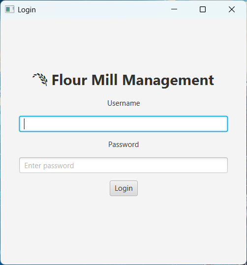
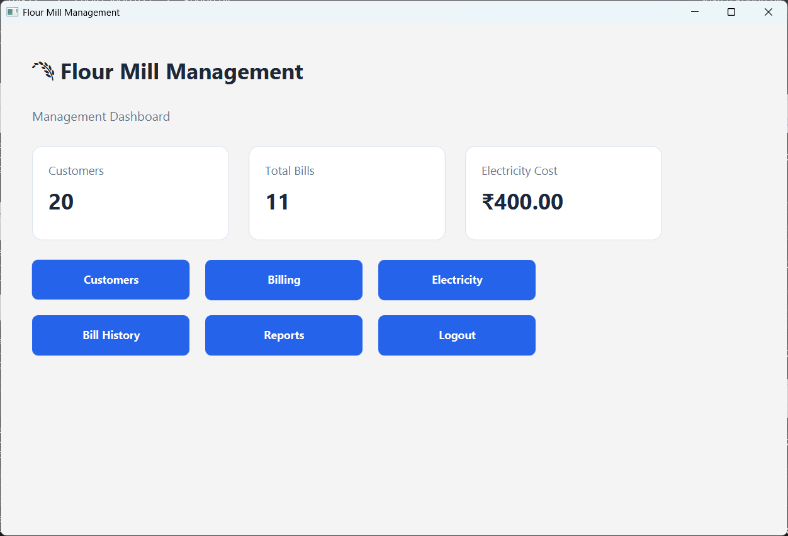
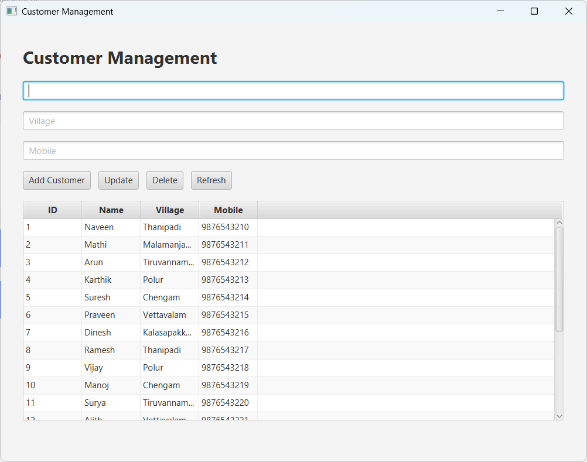
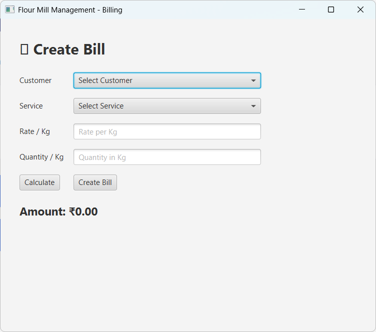
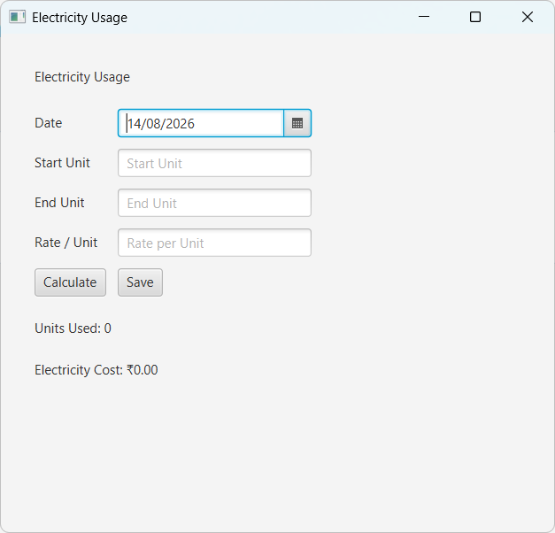
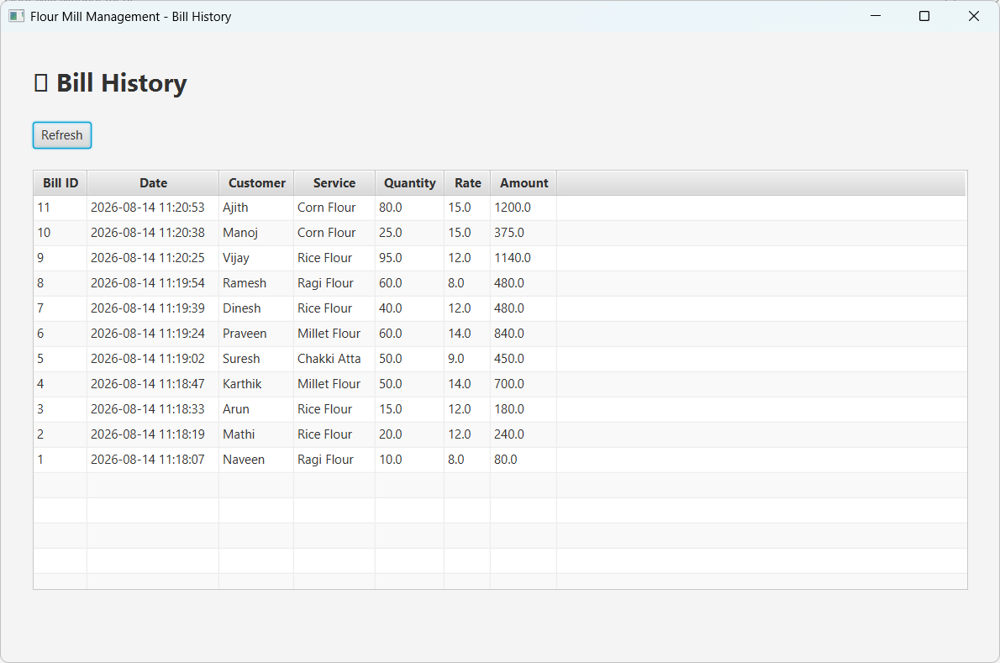
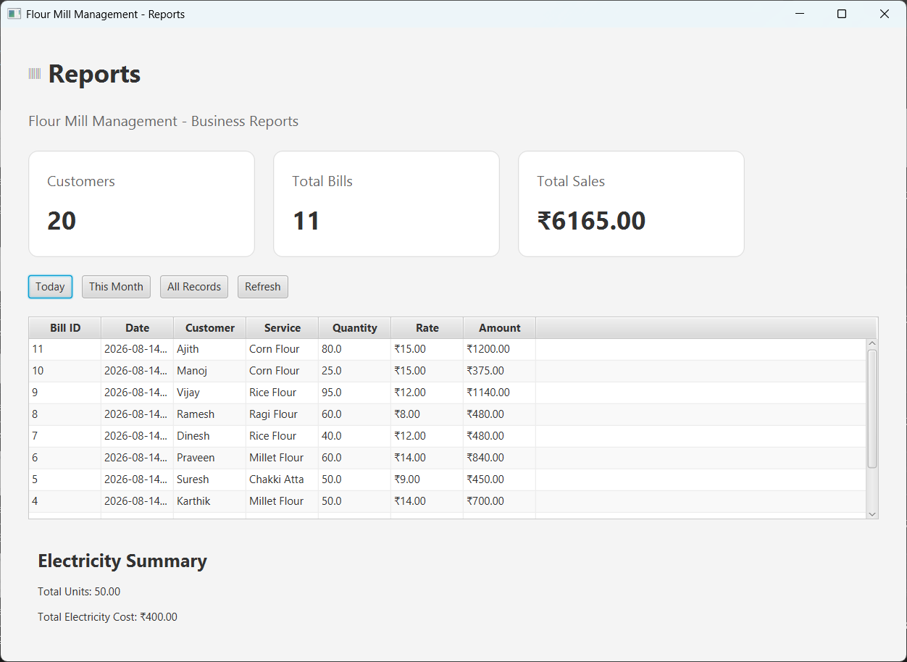

# Flour Mill Management System

A JavaFX desktop application for managing flour mill operations.

## Features

- Customer management
- Customer selection for billing
- Multiple mill services
- Bill creation
- Bill history
- Electricity usage tracking
- Business reports
- Dashboard with real database data
- Login screen

## Technologies Used

- Java
- JavaFX
- MySQL
- JDBC
- Maven
- IntelliJ IDEA

## Database

MySQL database is used to store:

- Customers
- Services
- Bills
- Bill Items
- Electricity Usage
- Users

## Project Structure

model → Data classes

dao → Database operations

ui → JavaFX screens

Database → SQL schema

## How to Run

1. Create the MySQL database using `schema.sql`
2. Configure database connection
3. Open the project in IntelliJ IDEA
4. Run `Main.java`

## Main Modules

### Customer Management
Add, update and delete customers.

### Billing
Select an existing customer and service, enter quantity and create a bill.

### Bill History
View previously created bills with customer, service, quantity, rate and amount.

### Electricity
Record electricity meter readings and calculate electricity cost.

### Reports
View business data and electricity records.

## Author

Naveen

## Screenshots

### Login

### Dashboard

### Customer Management

### Create Bill

### Electricity Usage

### Bill History

### Reports
